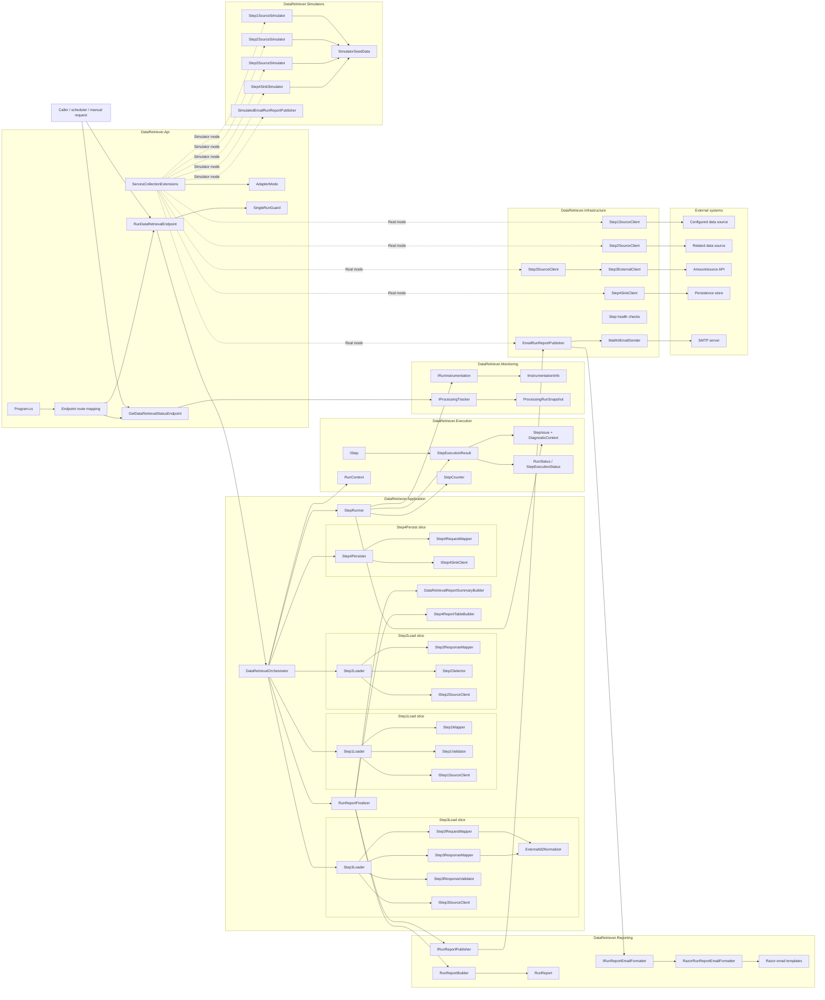
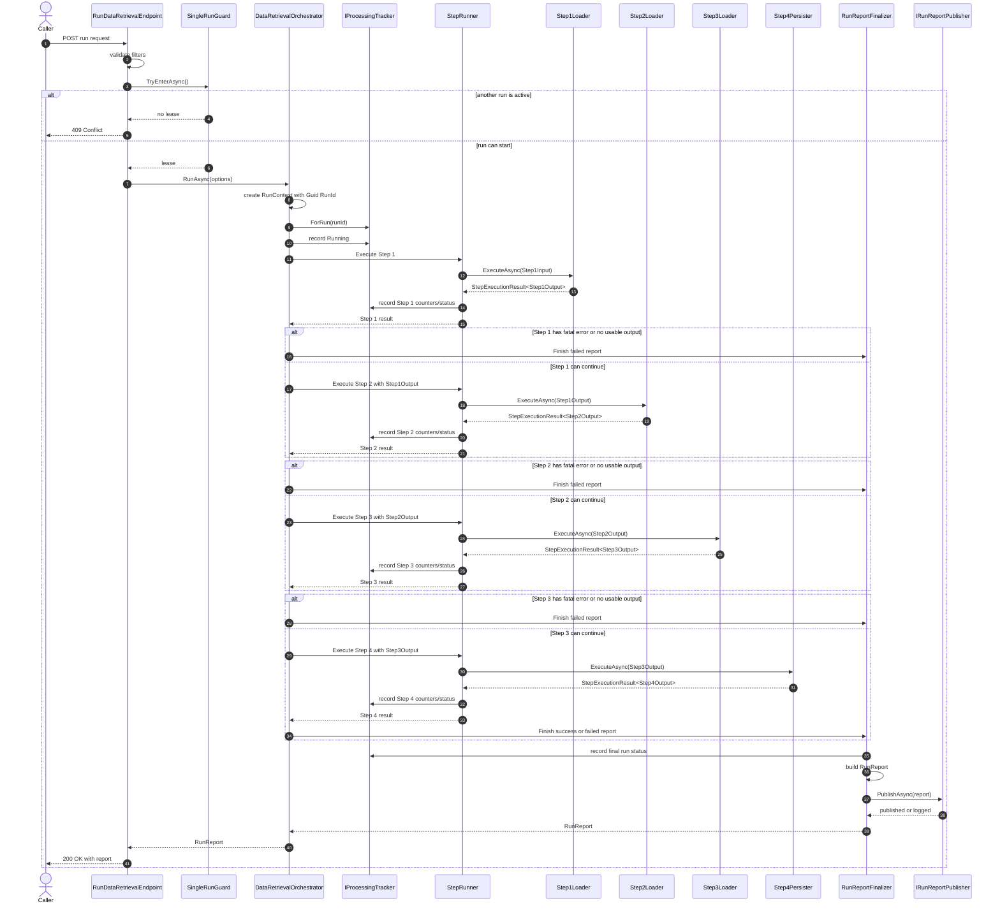
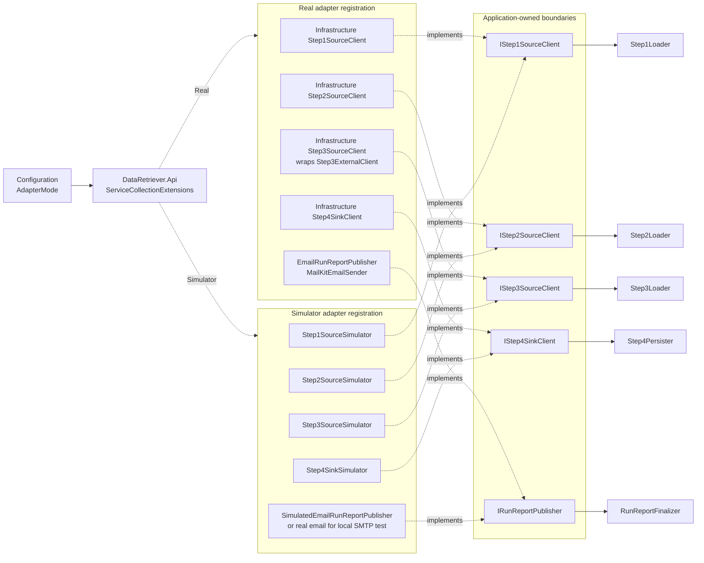
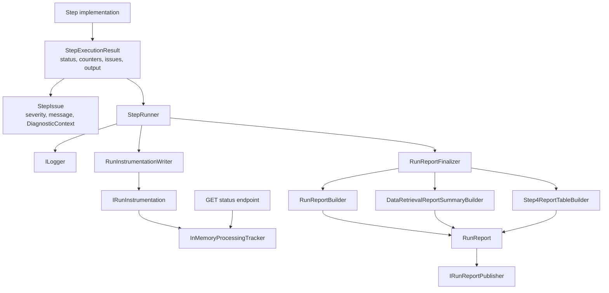
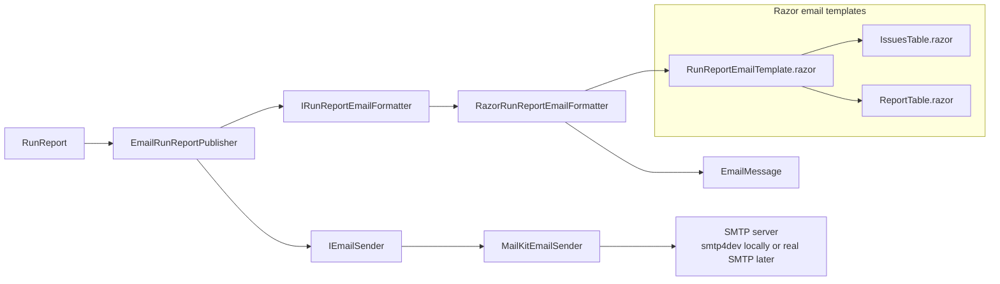
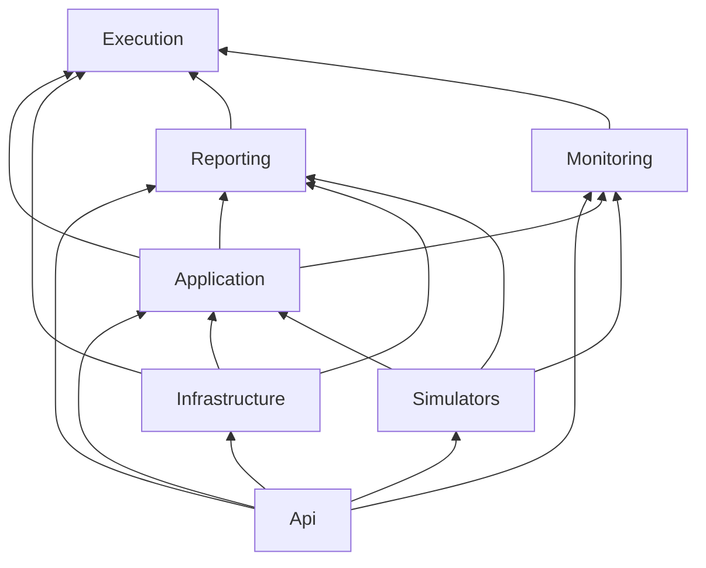

# DataRetriever Component Interactions

This document shows the major components in the template and how they interact at runtime.

Legend:

- Solid arrows are runtime calls or data flow.
- Dashed arrows are dependency-injection choices.
- `Application` owns orchestration and business flow.
- `Infrastructure` and `Simulators` implement application-owned boundaries.
- `Reporting` and `Monitoring` are reusable pieces that can be used together or separately.

## 1. Project Boundary View

## 2. Runtime Request Sequence

## 3. Step Data Flow

```mermaid
flowchart TB
    Request["RunDataRetrievalRequest<br/>optional currency OR internal ids"]
    Options["DataRetrievalRunOptions"]

    subgraph S1["Step 1: load configured data"]
        S1Input["Step1Input"]
        S1Client["IStep1SourceClient"]
        S1Dto["Step1Dto<br/>source row"]
        S1Mapper["Step1Mapper"]
        S1Validator["Step1Validator"]
        S1Output["Step1Output<br/>Step1OutputRecord[]"]
    end

    subgraph S2["Step 2: load related data"]
        S2Client["IStep2SourceClient"]
        S2Dto["Step2ResponseDto<br/>source row"]
        S2Mapper["Step2ResponseMapper"]
        S2Selector["Step2Selector"]
        S2Output["Step2Output<br/>Step2OutputRecord[]"]
    end

    subgraph S3["Step 3: load amount/source data"]
        S3RequestMapper["Step3RequestMapper"]
        S3Request["Step3RequestDto"]
        S3Client["IStep3SourceClient"]
        S3Response["Step3ResponseDto<br/>Step3ResponseItemDto[]"]
        S3ResponseMapper["Step3ResponseMapper"]
        S3Validator["Step3ResponseValidator"]
        S3Output["Step3Output<br/>Step3OutputRecord[]"]
    end

    subgraph S4["Step 4: persist final data"]
        S4RequestMapper["Step4RequestMapper"]
        S4Request["Step4RequestDto[]"]
        S4Sink["IStep4SinkClient"]
        S4Result["Step4PersistResult[]<br/>row-level outcomes"]
        S4Output["Step4Output<br/>persisted records"]
    end

    Request --> Options
    Options --> S1Input
    S1Input --> S1Client
    S1Client --> S1Dto
    S1Dto --> S1Mapper
    S1Mapper --> S1Validator
    S1Validator --> S1Output

    S1Output --> S2Client
    S2Client --> S2Dto
    S2Dto --> S2Mapper
    S2Mapper --> S2Selector
    S2Selector --> S2Output

    S2Output --> S3RequestMapper
    S3RequestMapper --> S3Request
    S3Request --> S3Client
    S3Client --> S3Response
    S3Response --> S3Validator
    S3Response --> S3ResponseMapper
    S3Validator --> S3Output
    S3ResponseMapper --> S3Output

    S3Output --> S4RequestMapper
    S4RequestMapper --> S4Request
    S4Request --> S4Sink
    S4Sink --> S4Result
    S4Result --> S4Output
```

The important template rule is that each step owns its own local models and mappers. The next step consumes the previous step's output as its input. External DTOs stay inside the relevant step slice.

## 4. Adapter Selection

The application layer does not know which implementation it receives. Switching from simulator-backed execution to real dependencies is a composition decision in the API host.

## 5. Monitoring, Logging, Issues, and Report Flow

This is why logging, monitoring, and reporting are related but not the same thing:

- Logging is immediate operational trace output.
- Monitoring is the current/latest run state exposed while the service is running.
- Reporting is the final structured artifact for a run, including issues and tables.

All three can use the same `StepIssue` and `DiagnosticContext`, so the same identifier context appears in logs and reports without forcing the systems to be physically combined.

## 6. Email Report Flow

The common email formatter owns layout. Each service owns the tables it adds to `RunReport.Tables`, such as the persisted-record table in this template.

Current email order:

1. Header and run status.
2. Errors, only when errors exist.
3. Warnings, only when warnings exist.
4. Optional stats, controlled by `RunReportEmail:DisplayStats`.
5. Report tables, such as persisted rows.

## 7. Dependency Direction Summary

The key design point is that infrastructure points inward to application interfaces, while the API host composes everything. The application flow remains testable because the loaders/persister depend on source/sink interfaces, not concrete databases, HTTP clients, SMTP, or simulators.
